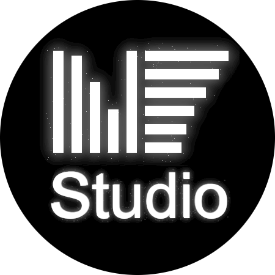

<!-- PROJECT TITLE -->
 

  

  <h3 align="center">Nom de projet</h3>

  

    Courte description de projet
     
    <a href=""><strong>Documentation</strong></a>
     
     
  

<!-- TABLE OF CONTENTS -->

  
Table of Contents

  <ol>
    <li>
      <a href="#about-the-project">About the project</a>
      <ul>
        <li><a href="#built-with">Built With</a></li>
      </ul>
    </li>
    <li>
      <a href="#getting-started">Getting Started</a>
      <ul>
        <li><a href="#prerequisites">Prerequisites</a></li>
        <li><a href="#installation">Installation</a></li>
      </ul>
    </li>
    <li><a href="#usage">Usage</a></li>
    <li><a href="#authors">Authors</a></li>
  </ol>

<!-- ABOUT THE PROJECT -->
## About the project

Ce projet est le projet long de l'unité d'enseignement Technologie Objet réalisé à l'ENSEEIHT en équipe de 8.
Il consiste en une application écrite en java nommée ...

(<a href="#readme-top">back to top</a>)

<!-- BUILT WITH -->
### Built With

(<a href="#readme-top">back to top</a>)

<!-- GETTING STARTED -->
## Getting Started
f
f
f
f
f
f
f
f
f
f
f
f
f
f
f
f
f
f
f
f
ff

f
ff

f
f
f
f

d

d

d

d

d

d

d

d

d

d

d

d

d

d

d
d

(<a href="#readme-top">back to top</a>)

<!-- PREREQUISITES -->
### Prerequisites

(<a href="#readme-top">back to top</a>)

<!-- INSTALLATION -->
### Installation

(<a href="#readme-top">back to top</a>)

<!-- USAGE -->
## Usage

(<a href="#readme-top">back to top</a>)

<!-- AUTHORS -->
## Authors

